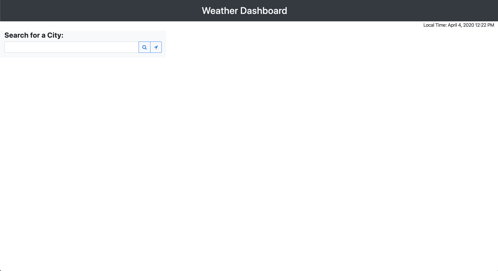
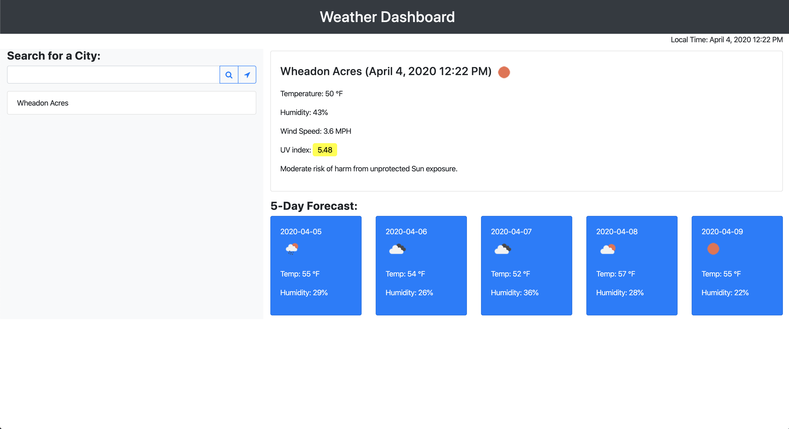
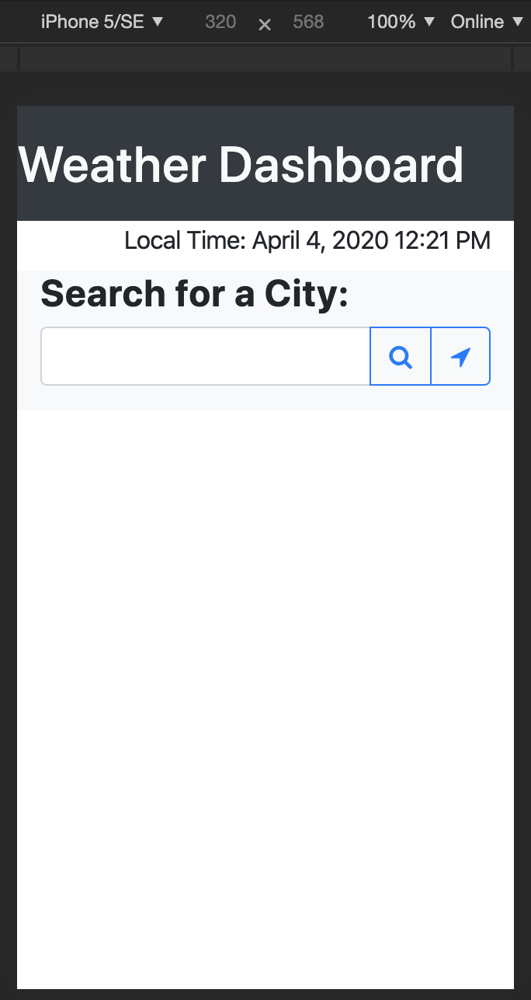
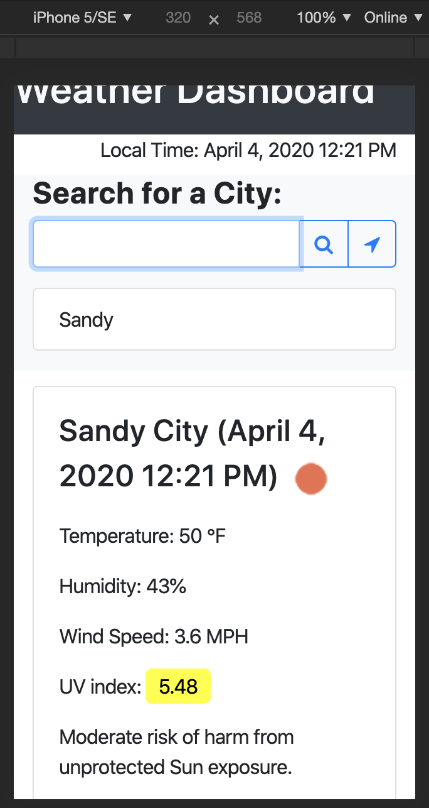
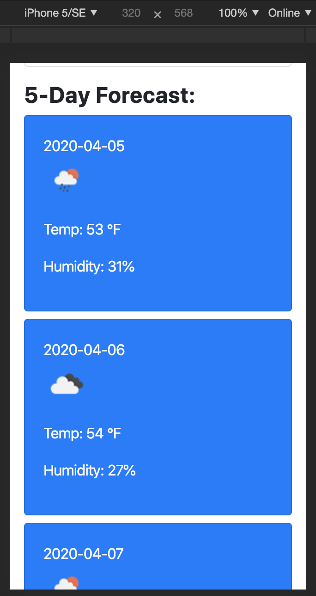

# Weather Dashboard
## User Story

```
AS A traveler
I WANT to see the weather outlook for multiple cities
SO THAT I can plan a trip accordingly
```

## About
In this page user can search current weather info and 5-day forecast info for any city. There's also a location button for user's current location weather info. All the searched city names will stored inside of local storage, so next time user opens this page, they will be presented with last searched city's weahter info and previous searched city names. 

I used openweathermap's api for this assignment. When the user search for a city, the Current weather data api will return with the info and print data on the right side of this page. And under the Current weather data, we got 5-day forecast from their One Call api, which uses geographical coordinates from the Current weahter data api. Another data that Current weather data api doesn't provide is the UV data. So I use the geographical coordinates from the Current weahter data api to use their UV index api to print the UV index for the city that user searched. The UV index will change its color depending on the number. From green, yellow, orange, red and violet. Each color corresponding to a short description to inform the user. 

If the user want the weather for their current location, they can simply click the gps button located on the right side of the search button. Web broswer will ask for permission to access user's location data. The location data is in the form of geographical coordinates and it will be pass to Current weather data api in order to print the weather infomation. 

When user search a city or use location button, the city name will be printed out as a list under the input box. User can also simply click on the city name inside of the search history to get weather infomation as well as 5-day forecast. 

Besides openweathermap I used Moment.js to display user's local time as well as the local time for the city that they searched.

## Link
[Weather Dashboard](https://terry0532.github.io/Weather-Dashboard/)

## ScreenShots




